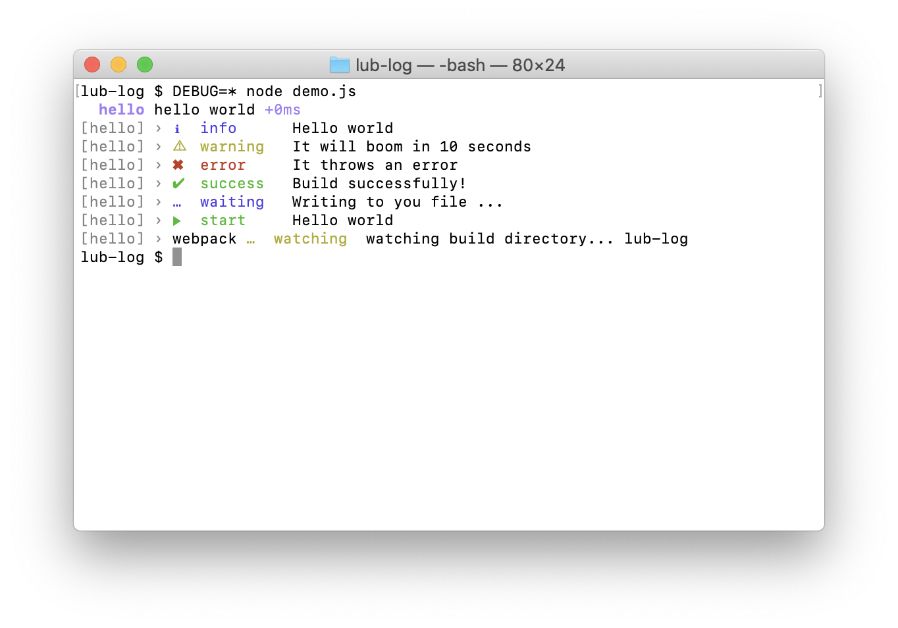
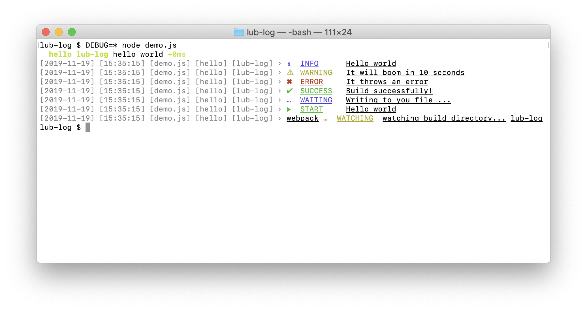

# `lub-log`

`lub-log` is a log util when you create your own lub plugin. <br/>

<details>
<summary>It supports several log types usually needed.</summary>

<br/>

- `debug`
- `log`
- `info`
- `warn`
- `error`
- `success`
- `wait`
- `start`
- `watch`

</details>


---

## Install
```bash
$ npm i lub-log --save
```

## Usage

### Basic
Setting your scope when require `lub-log` and log:

```javascript
const lubLog = require('./index')('hello');

lubLog.debug('hello world');
lubLog.info('Hello', 'world');
lubLog.warn('It will boom in %s seconds', '10');
lubLog.error('It throws an error');
lubLog.success('Build successfully!');
lubLog.wait('Writing to you file ...');
lubLog.start('Hello', 'world');
lubLog.watch({
  prefix: 'webpack',
  message: 'watching build directory...',
  suffix: 'lub-log',
});

```
<div align="center">
  
</div>

**`debug` method is based on [debug](https://github.com/visionmedia/debug), you scope name will be passed as debug's module name**

### Advanced
You can also pass more configs into `lub-log`,to log some useful info like date, time, filename:
```javascript
const lubLog = require('./index')({
  scope: [ 'hello', 'lub-log' ],
  config: {
    displayDate: true,
    displayTimestamp: true,
    displayFilename: true,
    displayLabel: true,
    displayBadge: true,
    underlinePrefix: true,
    uppercaseLabel: true,
    underlineLabel: true,
    underlineMessage: true,
    underlineSuffix: true,
  },
});

lubLog.debug('hello world');
lubLog.info('Hello', 'world');
lubLog.warn('It will boom in %s seconds', '10');
lubLog.error('It throws an error');
lubLog.success('Build successfully!');
lubLog.wait('Writing to you file ...');
lubLog.start('Hello', 'world');
lubLog.watch({
  prefix: 'webpack',
  message: 'watching build directory...',
  suffix: 'lub-log',
});

```
<div align="center">
  
</div>

## API

#### lubLog.`<logger>(message[, message]|messageObj|errorObj)`

##### **`logger`**

- type: `Function`

One of several log types usually needed mentioned above.

##### **`message`**

- type: `String`

Can be one or more comma delimited strings. <br />
They will be formated by [Nodejs's util lib](http://nodejs.cn/api/util.html#util_util_format_format_args);

```javascript
const lubLog = require('lub-log')();

lubLog.success('Successful operation');
//=> ✔  success  Successful operation

lubLog.success('Successful', 'operation');
//=> ✔  success  Successful operation

lubLog.success('Successful %s', 'operation');
//=> ✔  success  Successful operation
```


##### **`messageObj`**

- type: `Object`

A object with `prefix`, `message` and `suffix` props.

```javascript
const lubLog = require('lub-log');

lubLog.complete({prefix: '[webpack]', message: 'build successfully', suffix: 'index.js'});
//=> [webpack] ☒  complete  build successfully index.js
```

##### **`errorObj`**

- type: `Error Object`

When you pass an error object, `lub-log` will log stack info:

```javascript
const lubLog = require('lub-log');

lubLog.error(new Error('Unsuccessful operation'));
//=> ✖  error  Error: Unsuccessful operation
//        at Module._compile (module.js:660:30)
//        at Object.Module._extensions..js (module.js:671:10)
//        ...
```

#### lubLog.`scope(name[, name])`

Defines the scope name of the logger.

##### **`name`**

- type: `String`

#### lubLog.`unscope()`

Clear the scope name of the logger.

#### lubLog.`config(setting)`

Defines the setting config of the logger.

##### **`setting`**

- type: `Object`

The default config value is:

```javascript
{
  displayDate: false,
  displayTimestamp: false,
  displayFilename: false,
  displayLabel: true,
  displayBadge: true,
  underlinePrefix: false,
  uppercaseLabel: false,
  underlineLabel: false,
  underlineMessage: false,
  underlineSuffix: false,
}
```